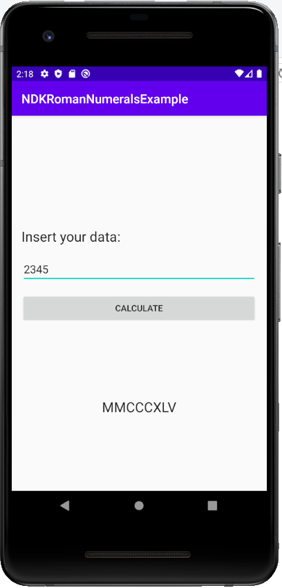
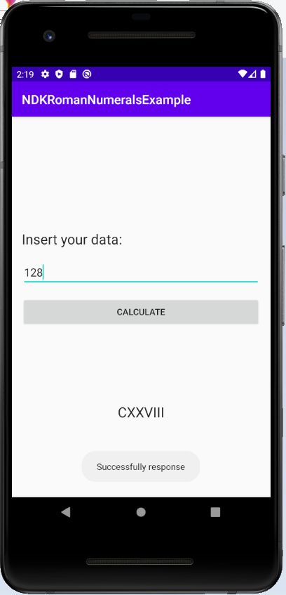
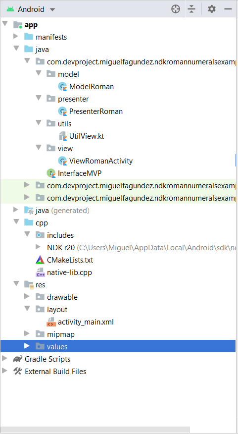

# NDKExample
Using C/C++ code in Android.

### * Native Development Kit and Java Native Interface.
SDK Manager -> Install: CMake, NDK, and LLDB (SDK Tools)
### * MVP Architecture

### This project was published in Google Play (v1.2):
https://play.google.com/store/apps/details?id=com.devproject.miguelfagundez.romanempire

### * Visual results and code structure:

 -  - 
